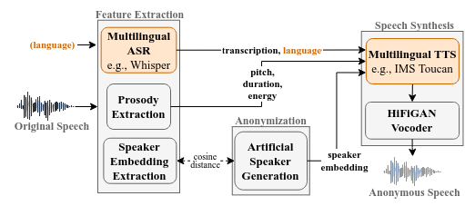

# Speaker Anonymization

**News: The main branch of the repository contains now the code to our latest paper, Probing the Feasibility of Multilingual Speaker Anonymization,
that has been accepted at Interspeech 2024. For the previous version, please go to the [prosody_cloning](https://github.com/DigitalPhonetics/speaker-anonymization/tree/prosody_cloning)  branch.**

This repository contains the speaker anonymization system developed at the Institute for Natural Language Processing 
(IMS) at the University of Stuttgart, Germany. The system is described in the following papers:

| Paper | Published at | Branch                                                                                                              | Demo |
|-------|--------------|---------------------------------------------------------------------------------------------------------------------|------|
| [Speaker Anonymization with Phonetic Intermediate Representations](https://www.isca-speech.org/archive/interspeech_2022/meyer22b_interspeech.html) | [Interspeech 2022](https://www.interspeech2022.org/) | [phonetic_representations](https://github.com/DigitalPhonetics/speaker-anonymization/tree/phonetic_representations) | [https://huggingface.co/spaces/sarinam/speaker-anonymization](https://huggingface.co/spaces/sarinam/speaker-anonymization) |
| [Anonymizing Speech with Generative Adversarial Networks to Preserve Speaker Privacy](https://ieeexplore.ieee.org/document/10022601) | [SLT 2022](https://slt2022.org/) | [gan_embeddings](https://github.com/DigitalPhonetics/speaker-anonymization/tree/gan_embeddings)                     | [https://huggingface.co/spaces/sarinam/speaker-anonymization-gan](https://huggingface.co/spaces/sarinam/speaker-anonymization-gan) |
| [Prosody Is Not Identity: A Speaker Anonymization Approach Using Prosody Cloning](https://ieeexplore.ieee.org/document/10096607) | [ICASSP 2023](https://2023.ieeeicassp.org/) | [prosody_cloning](https://github.com/DigitalPhonetics/speaker-anonymization/tree/prosody_cloning)                   | - |
| [Probing the Feasibility of Multilingual Speaker Anonymization](https://www.isca-archive.org/interspeech_2024/meyer24_interspeech.html) | [Interspeech 2024](https://interspeech2024.org/) | [multilingual](https://github.com/DigitalPhonetics/speaker-anonymization/tree/multilingual)                         | Audio samples: [https://multilingualspeakeranonymization.github.io](https://multilingualspeakeranonymization.github.io) |

If you want to see the code to the respective papers, go to the branch referenced in the table. The latest version 
of our system can be found here on the main branch.

**Check out our live demo on Hugging Face: [https://huggingface.co/spaces/sarinam/speaker-anonymization](https://huggingface.co/spaces/sarinam/speaker-anonymization)**

**Check also out [our contribution](https://www.voiceprivacychallenge.org/results-2022/docs/3___T04.pdf) to the [Voice Privacy Challenge 2022](https://www.voiceprivacychallenge.org/results-2022/)!**


## System Description
The system, as described in [our paper at ICASSP 2023](https://ieeexplore.ieee.org/document/10096607), consists of three steps:

(1) Three kinds of information are extracted from the input signal:
* the linguistic content using an E2E ASR, represented in form of phonetic transcriptions
* the prosody in form of phone-wise normalized pitch, energy and duration values
* the speaker embedding in form of GST style embeddings, trained together with the TTS

(2) Speaker-specific information are anonymized to hide the speaker identity
* this is done by sampling an artificial speaker embedding generated by a GAN (described [in this paper](https://ieeexplore.ieee.org/document/10022601))
and replacing the embedding of the input speaker with this artificial one. Using cosine distance, we make sure that the new embedding is not too similar to the 
original one
* we can further manipulate pitch and energy using random offsets (this is not done in the current configs)

(3) Synthesis of the anonymized speech
* using a FastSpeech2-like TTS and a HiFiGAN vocoder, as implemented in our speech synthesis toolkit [IMSToucan](https://github.com/DigitalPhonetics/IMS-Toucan), we use the different information paths to 
generate an anonymized version of the input speech

### Multilingual additions
Our current implementation is based on the structure in our Voice Privacy toolkit [VoicePAT](https://github.com/DigitalPhonetics/VoicePAT).

The main differences to the system described above are the replacements of ASR and TTS models by multilingual counterparts:
* We replace our monolingual custom ASR by OpenAI's [Whisper-large-v3](https://huggingface.co/openai/whisper-large-v3). This model supports 99 languages and includes its own language
identification (currently not used in our system). The output of the model are orthographic text transcriptions.
* We replace our monolingual TTS with a new version that supports 12 languages, described in the paper 
[Low-Resource Multilingual and Zero-Shot Multispeaker TTS](https://aclanthology.org/2022.aacl-main.56). All code and models are provided in 
[IMS Toucan v2.5](https://github.com/DigitalPhonetics/IMS-Toucan/tree/v2.5) which is included as a submodule in this repository

(We plan to soon update the TTS to our [latest version supporting over 7000 languages!](https://github.com/DigitalPhonetics/IMS-Toucan/releases/tag/v3.0))




## Multilingual Data
We propose new speaker verification trials for multilingual speaker anonymization. For this, we use Multilingual LibriSpeech (MLS) and CommonVoice (CV).
You can find these new trials in the [trials_data](trials_data) folder. Some additional information about the data format can be found in [trials_data/README.md](trials_data/README.md).

*Note: We do not propose new data collections but only trial files for already existing corpora.*

The data is available for 9 languages: English (en), German (de), French (fr), Italian (it), Spanish (es), Portuguese (pt), Dutch (nl), Polish (pl), and Russian (ru).
In the following, we will refer to them only by their language codes.

### Data Preparation Process
For the preparation of the data into enrollment and trial subset, we tried to follow the dev and test files of the Voice Privacy Challenge 2022.
This results in far more nontarget than target trials, and additional speakers in the trial set that are not contained in the enrollment set.
In the following, we describe for MLS and CV separately how we obtained the splits given in [trials_data](trials_data).

#### MLS
The MLS corpus ([available here](https://www.openslr.org/94/)) already comes with a split into train / dev / test, which we reuse here.
The data is further divided into 8 languages: en, de, nl, fr, es, it, pt and pl.
We only take the dev and test sets for 6 languages (de, nl, fr, es, it, and pt). 
For en, we already have an alternative from the Voice Privacy Challenges based on the monolingual English LibriSpeech, so there is no need for another part from MLS.
For pl, the MLS part only contains 2 speakers per gender and dev / test split, which is too small for effective speaker verification.
*(Sidenote: Dutch is not significantly bigger with only 3 speakers per gender and split, but we decided to keep it anyway).*
We do not further restrict the number of utterances or speaker in each language and dev / test set, which results in a large inbalance across languages.
However, as given in the original MLS splits, the languages itself are balanced in terms of gender

#### CV
Mozilla's CV data collection is significantly bigger than MLS, so we could select more speakers per language and make sure that the datasets per language were more or less balanced.
We take the data from CV Version 16.1 ([available here](https://commonvoice.mozilla.org/en/datasets)).
Please note that users who *donated* their voice to the data collection can opt out of being included in the data at any point.
This means that some speakers or utterances contained in our trial data might be missing in future downloads of the CV corpus.
We further want to mention that we had to use the field `client ID` in the CV corpus for speaker assignment which is not fully accurate. 
The same speaker might end up with several client IDs if they are recording the utterances in different sessions. 
However, for the purpose of speaker anonymization, this issue is not as relevant as for pure speaker recognition.

We use CV for all of our 9 languages. 
CV does not come with a division into train / dev / test splits, so we randomly sample speakers and utterances from it.
For this sampling, we consider only speakers that have gender annotated as either female or male, and have recorded at least 50 validated audios.
We further make sure that we have the same number of female as male speakers which leads for several languages to a large reduction in size, with most languages having far more male speakers in CV than female speakers.
This leads especially to a smaller dataset for pl, for which only 14 speakers per gender and dev / test split are available.
We randomly select at most 20 speakers per gender for each dev and test in each language, and randomly choose up to 70 utterances per speaker.
As our lower bound for speaker selection was originally 50 utterances per speaker, this results in 50-70 utterances per speaker.


#### Separation into Enrollment and Trials
In MLS, we use all speakers for the enrollment and trial. The only exception is de, for which more speakers are available. 
In the MLS-de data, we reserve 5 speakers per gender and split for trial only, which creates some unseen distraction speakers in the trial data.
In CV, we use 15 speakers per gender and split for enrollment (except for the smaller pl part, for which it is only 10), and also reserve up to 5 speakers per gender and split only for trial.
Naturally, all enrollment speakers are also used in trial.

15% of all utterances of a speaker (at least 5 utterances) are used as enrollment utterances, the rest for trial.
All trial utterances are paired with each enrollment speaker of the respective gender.
If an enrollment speaker is the actual speaker of that utterance, this is denoted as *target*, otherwise as *nontarget*.

During the trials, the enrollment speaker is modeled as an average of the speaker embeddings of all enrollment utterances of that speaker.


### Statistics
For transparency, we provide concrete statistics for each dataset, language and dev / test split. 
In these statistics, we don't distinguish between female and male speakers, but the numbers are balanced for each subset.
The Libri and VCTK datasets are marked with asterisk (*) because they are not contained in this multilingual dataset but have to be obtained from the Voice Privacy Challenge organizers.
Note that we use the development data only for internal tests. All results reported in our paper are obtained on the test data only.

The following information is given for each dataset and language:
* \# speakers: number of speakers used for both enrollment and trial (50% female / 50% male)
* \# add.trial speakers: number of speakers additionally used only in trial
* \# enroll utts: total number of utterances used in enrollment (across all speakers)
* \# trial utts: total number of utterances used in trials (across all speakers)
* \# target trials: number of target trials (enrollment speaker == trial speaker)
* \# nontarget trials: number of nontarget trials (enrollment speaker != trial speaker)
* \# words: total number of words across all trial utterances (the WER is computed based on them)
* \# avg. utt length: average length of all utterances in the dataset, in seconds

#### Development Data

##### Total dataset statistics:

| Dataset | Lang | # speakers | # add. trial speakers | # enroll utts | # trial utts | # target trials | # nontarget trials | # words | avg. utt length |
|---------|------|------------|-----------------------|---------------|--------------|-----------------|--------------------|---------|-----------------|
| Libri*  | en   | 29         | 11                    | 343           | 1978         | 1,348           | 27,362             | 39,804  | 6.99            |
| VCTK*   | en   | 30         | 0                     | 600           | 11,372       | 4,491           | 35,925             | 86,627  | 3.31            |
| MLS     | de   | 20         | 10                    | 333           | 3,136        | 1,936           | 29,424             | 111,245 | 14.90           |
|         | fr   | 18         | 0                     | 354           | 2,062        | 2,062           | 16,496             | 73,007  | 15.03           |
|         | it   | 10         | 0                     | 183           | 1,065        | 1,065           | 4,260              | 34,636  | 14.88           |
|         | es   | 20         | 0                     | 349           | 2,059        | 2,059           | 18,531             | 74,782  | 14.95           |
|         | pt   | 10         | 0                     | 119           | 707          | 707             | 2,828              | 24,733  | 15.90           |
|         | nl   | 6          | 0                     | 461           | 2,634        | 2,634           | 5,268              | 11,0384 | 14.83           |
| CV      | en   | 30         | 10                    | 279           | 2,306        | 1,691           | 32,899             | 22,394  | 4.96            |
|         | de   | 30         | 9                     | 289           | 2,396        | 1,738           | 34,202             | 21,421  | 5.16            |
|         | fr   | 30         | 10                    | 293           | 2,432        | 1,761           | 34,719             | 23,240  | 4.93            |
|         | it   | 30         | 10                    | 286           | 2,421        | 1,722           | 34,593             | 23,745  | 5.69            |
|         | es   | 30         | 10                    | 290           | 2,401        | 1,735           | 34,280             | 22,569  | 5.23            |
|         | pt   | 30         | 10                    | 284           | 2,398        | 1,708           | 34,262             | 16,411  | 3.97            |
|         | nl   | 30         | 10                    | 288           | 2,401        | 1,725           | 34,290             | 22,108  | 4.51            |
|         | pl   | 20         | 8                     | 199           | 1,739        | 1,196           | 16,194             | 12,876  | 4.39            |
|         | ru   | 30         | 10                    | 289           | 2,429        | 1,737           | 34,698             | 20,599  | 5.24            |

##### Dataset statistics per speaker (average)

| Dataset | Lang | # enroll utts | # trial utts | # target trials | # nontarget trials | # words  | 
|---------|------|---------------|--------------|-----------------|--------------------|----------|
| Libri*  | en   | 11.8          | 49.4         | 46.5            | 942.5              | 951.5    |
| VCTK*   | en   | 20.0          | 379.1        | 149.7           | 1,197.5            | 2,790.0  |
| MLS     | de   | 16.6          | 104.5        | 96.8            | 1,471.2            | 3,553.0  |
|         | fr   | 19.7          | 114.6        | 114.6           | 916.4              | 4,350.0  |
|         | it   | 18.3          | 106.5        | 106.5           | 426.0              | 4,405.5  |
|         | es   | 17.4          | 103.0        | 103.0           | 926.6              | 4,300.5  |
|         | pt   | 11.9          | 70.7         | 70.7            | 282.8              | 2,084.0  |
|         | nl   | 76.8          | 439.0        | 439.0           | 878.0              | 45,515.0 |
| CV      | en   | 9.3           | 59.1         | 56.4            | 1,096.6            | 627.0    |
|         | de   | 9.6           | 59.9         | 57.9            | 1,140.1            | 492.5    |
|         | fr   | 9.8           | 60.8         | 58.7            | 1,157.3            | 606.0    |
|         | it   | 9.5           | 60.5         | 57.4            | 1,153.1            | 594.5    |
|         | es   | 9.7           | 60.0         | 57.8            | 1,142.7            | 494.0    |
|         | pt   | 9.5           | 60.0         | 56.9            | 1,142.1            | 308.0    |
|         | nl   | 9.6           | 60.0         | 57.5            | 1,143.0            | 520.5    |
|         | pl   | 10.0          | 62.1         | 59.8            | 809.7              | 514.5    |
|         | ru   | 9.6           | 60.7         | 57.9            | 1,156.6            | 502.0    |

#### Test Data
##### Total dataset statistics:

| Dataset | Lang | # speakers | # add. trial speakers | # enroll utts | # trial utts | # target trials | # nontarget trials | # words | avg. utt length |
|---------|------|------------|-----------------------|---------------|--------------|-----------------|--------------------|---------|-----------------|
| Libri*  | en   | 29         | 11                    | 438           | 1,496        | 997             | 20,653             | 35,042  | 7.83            |
| VCTK*   | en   | 30         | 0                     | 600           | 11,448       | 4,386           | 36,104             | 86,642  | 3.16            |
| MLS     | de   | 30         | 0                     | 329           | 3,065        | 1,906           | 28,744             | 110,202 | 15.18           |
|         | fr   | 18         | 0                     | 357           | 2,069        | 2,069           | 16,552             | 79,524  | 14.94           |
|         | it   | 10         | 0                     | 185           | 1,077        | 1,077           | 4,308              | 34,796  | 15.07           |
|         | es   | 20         | 0                     | 348           | 2,037        | 2,037           | 18,333             | 75,536  | 15.11           |
|         | pt   | 10         | 0                     | 125           | 746          | 746             | 2,984              | 26,769  | 15.47           |
|         | nl   | 6          | 0                     | 458           | 2,617        | 2,617           | 5,234              | 108,489 | 14.96           |
| CV      | en   | 30         | 9                     | 289           | 2,344        | 1,733           | 33,427             | 22,560  | 5.09            |
|         | de   | 30         | 10                    | 284           | 2,377        | 1,713           | 33,942             | 21,492  | 5.24            |
|         | fr   | 30         | 10                    | 291           | 2,408        | 1,745           | 34,275             | 22,887  | 4.74            |
|         | it   | 30         | 10                    | 298           | 2,444        | 1,786           | 34,874             | 24,091  | 5.37            |
|         | es   | 30         | 10                    | 284           | 2,377        | 1,703           | 33,952             | 22,655  | 5.25            |
|         | pt   | 30         | 7                     | 290           | 2,213        | 1,743           | 31,452             | 15,727  | 4.23            |
|         | nl   | 30         | 10                    | 283           | 2,254        | 1,704           | 32,106             | 19,913  | 4.32            |
|         | pl   | 20         | 8                     | 196           | 1,712        | 1,181           | 15,939             | 13,809  | 4.82            |
|         | ru   | 30         | 10                    | 294           | 2,435        | 1,759           | 34,766             | 20,509  | 5.13            |

##### Dataset statistics per speaker (average)

| Dataset | Lang | # enroll utts | # trial utts | # target trials | # nontarget trials | # words  | 
|---------|------|---------------|--------------|-----------------|--------------------|----------|
| Libri*  | en   | 15.1          | 37.4         | 34.4            | 713.6              | 671.5    |
| VCTK*   | en   | 20.0          | 381.6        | 146.2           | 1,203.5            | 2,832.5  |
| MLS     | de   | 16.4          | 102.2        | 95.3            | 1,437.2            | 4,047.0  |
|         | fr   | 19.8          | 114.9        | 114.9           | 919.6              | 3,945.5  |
|         | it   | 18.5          | 107.7        | 107.7           | 430.8              | 3,658.0  |
|         | es   | 17.4          | 101.8        | 101.8           | 916.6              | 4,870.5  |
|         | pt   | 12.5          | 74.6         | 74.6            | 298.4              | 3,141.5  |
|         | nl   | 76.3          | 436.2        | 436.2           | 872.3              | 24,892.5 |
| CV      | en   | 9.6           | 60.1         | 57.8            | 1,114.2            | 551.5    |
|         | de   | 9.5           | 59.4         | 57.1            | 1,131.4            | 568.5    |
|         | fr   | 9.7           | 60.2         | 58.2            | 1,145.8            | 618.0    |
|         | it   | 9.9           | 61.1         | 59.5            | 1,162.5            | 612.0    |
|         | es   | 9.5           | 59.4         | 56.8            | 1,131.7            | 610.0    |
|         | pt   | 9.7           | 59.7         | 58.1            | 1,048.4            | 409.5    |
|         | nl   | 9.4           | 59.3         | 56.8            | 1,070.2            | 564.0    |
|         | pl   | 9.8           | 61.1         | 59.0            | 797.0              | 515.0    |
|         | ru   | 9.8           | 60.9         | 58.6            | 1,158.9            | 392.5    |

## Audio Samples
You can find some audio samples for all languages and datasets here: [https://multilingualspeakeranonymization.github.io](https://multilingualspeakeranonymization.github.io).

## Installation
### 1. Clone repository
Clone this repository with all its submodules:
```
git clone --recurse-submodules https://github.com/DigitalPhonetics/speaker-anonymization.git
``` 

### 2. Download models
You will need to download the following models and specify the location to them in the respective config files:

For anonymization:

| Name | Function | Link | Location in config |
|------|----------|------|--------------------|
| embedding_function.pt | Speaker embedding encoder | [https://github.com/DigitalPhonetics/IMS-Toucan/releases/download/v2.5/embedding_function.pt](https://github.com/DigitalPhonetics/IMS-Toucan/releases/download/v2.5/embedding_function.pt) | modules > speaker_embeddings > embed_model_path && modules > tts > embeddings_path |
| embedding_gan.pt | Artificial speaker embeddings generator | [https://github.com/DigitalPhonetics/IMS-Toucan/releases/download/v2.5/embedding_gan.pt](https://github.com/DigitalPhonetics/IMS-Toucan/releases/download/v2.5/embedding_gan.pt) | tbd |
| aligner.pt | Prosody aligner | [https://github.com/DigitalPhonetics/IMS-Toucan/releases/download/v2.5/aligner.pt](https://github.com/DigitalPhonetics/IMS-Toucan/releases/download/v2.5/aligner.pt) | modules > prosody > aligner_model_path |
| ToucanTTS_Meta.pt | TTS model | [https://github.com/DigitalPhonetics/IMS-Toucan/releases/download/v2.5/ToucanTTS_Meta.pt](https://github.com/DigitalPhonetics/IMS-Toucan/releases/download/v2.5/ToucanTTS_Meta.pt) | modules > tts > fastspeech_path |
| Avocodo.pt | Vocoder | [https://github.com/DigitalPhonetics/IMS-Toucan/releases/download/v2.5/Avocodo.pt](https://github.com/DigitalPhonetics/IMS-Toucan/releases/download/v2.5/Avocodo.pt) | modules > tts > hifigan_path |
| asr_branchformer_tts-phn_en.zip | Monolingual ASR model | [https://github.com/DigitalPhonetics/speaker-anonymization/releases/download/v2.0/asr_branchformer_tts-phn_en.zip](https://github.com/DigitalPhonetics/speaker-anonymization/releases/download/v2.0/asr_branchformer_tts-phn_en.zip) | modules > asr > model_path |

For evaluation:

| Name | Function             | Link | Location in config |
|------|----------------------|------|--------------------|
| asv_pre_ecapa | Pretrained ASV model | [https://github.com/DigitalPhonetics/VoicePAT/releases/download/v1/pre_eval_models.zip](https://github.com/DigitalPhonetics/VoicePAT/releases/download/v1/pre_eval_models.zip) | privacy > asv > model_dir |
You need to unzip the pre_eval_models.zip first. The folders contain some more models that you don't need for the experiments given in the configs.

The whisper model is downloaded automatically.

### 4. Install requirements
Create a virtual environment and install the [requirements](requirements.txt). The current code has been tested with Python 3.10.
```
pip install -r requirements.txt
```

### 4. Prepare data
As described above, we include the trial data for Multilingual LibriSpeech and CommonVoice in several languages.
Before you can use them, you need to prepare the data information in kaldi format. For this, simply run the following command:
```
python run_prepare_data.py --mls_path <path-to-MLS-corpus> --cv_path <path-to-CV-corpus> --output_path <path-to-output-files>
```
You need to specify the location of the [MLS](http://www.openslr.org/94) and [CommonVoice](https://commonvoice.mozilla.org/en/datasets) corpora. 
If you don't already have them on your computer, you need to download these corpora first.
Note that we expect that you have CommonVoice version 16.1 or higher for all languages.

`<path-to-MLS-corpus>` should point to the root directory of the MLS dataset, in which folders like `mls_dutch` are located.
`<path-to-CV-corpus>` should point to the root directory for the CommonVoice version, in which folders like `nl` are located.
`<path-to-output-files>` points to `data` as subfolder of this repository by default.

If you want to test the model on the standard voice privacy evaluation splits for English, and train the ASV model on LibriSpeech train-clean-360,
please go to the [VPC 2022 website](https://github.com/Voice-Privacy-Challenge/Voice-Privacy-Challenge-2022) to request data access. These files should also be located in your `<path-to-output-files>`.


## Running the anonymization and evaluation pipelines
All settings in the pipeline are controlled in config files, located in the [configs](configs) folder. 
Before running any scripts, make sure that you set all paths in these configs correctly.
Anonymization and evaluation are executed in separate pipelines. You can run them with simple commands:

### Anonymization:
```
python run_anonymization.py --config anon/anon_ims_sttts_pc_whisper.yaml --lang <lang> --gpu_ids <gpu_ids>
```
`<lang>` is the tag of the language you want to run the anonymization for, e.g., `en`, `de`, `it`.
`<gpu_ids>` is a string of one or several GPU IDs you want the anonymization to use, e.g., `0` or `0,2,4`.

### Evaluation:
There are two types of evaluation configs. If you are confused about this, please check out the [evaluation plan of the VPC 2022](https://arxiv.org/abs/2203.12468).

#### Evaluation with models trained on original data (eval_pre)
```
python run_evaluation.py --config eval_pre/eval_pre_whisper.yaml --lang <lang> --gpu_ids <gpu_ids>
```

#### ASV evaluation with a model trained on anonymized data (eval_post)
For this, you first need to run the pipeline for English to train the model. Make sure that you have anonymized the libri-clean-360 first (we need this as training data). 

*Note: In the current version, we finetune the pretrained model on only a part of the anonymized libri-clean-360. You can find the kaldi files for this part in the [data.zip](https://github.com/DigitalPhonetics/VoicePAT/releases/download/v2/data.zip) of VoicePAT.*
```
python run_evaluation.py --config eval_post/eval_post_asv_en_training.yaml --lang en --gpu_ids <gpu_ids>
```

After that, you can use this model for other languages too:
```
python run_evaluation.py --config eval_post/eval_post_asv_with_trained_model.yaml --lang <lang> --gpu_ids <gpu_ids>
```

## Citations
```
@inproceedings{meyer2022speaker,
  author={Sarina Meyer and Florian Lux and Pavel Denisov and Julia Koch and Pascal Tilli and Ngoc Thang Vu},
  title={{Speaker Anonymization with Phonetic Intermediate Representations}},
  year=2022,
  booktitle={Proc. Interspeech 2022},
  pages={4925--4929},
  doi={10.21437/Interspeech.2022-10703}
}
@inproceedings{meyer2023anonymizing,
  author={Meyer, Sarina and Tilli, Pascal and Denisov, Pavel and Lux, Florian and Koch, Julia and Vu, Ngoc Thang},
  booktitle={2022 IEEE Spoken Language Technology Workshop (SLT)}, 
  title={Anonymizing Speech with Generative Adversarial Networks to Preserve Speaker Privacy}, 
  year={2023},
  pages={912-919},
  doi={10.1109/SLT54892.2023.10022601}
 }
@inproceedings{meyer2023prosody,
  author={Meyer, Sarina and Lux, Florian and Koch, Julia and Denisov, Pavel and Tilli, Pascal and Vu, Ngoc Thang},
  booktitle={ICASSP 2023 - 2023 IEEE International Conference on Acoustics, Speech and Signal Processing (ICASSP)}, 
  title={Prosody Is Not Identity: A Speaker Anonymization Approach Using Prosody Cloning}, 
  year={2023},
  pages={1-5},
  doi={10.1109/ICASSP49357.2023.10096607}
}
```

